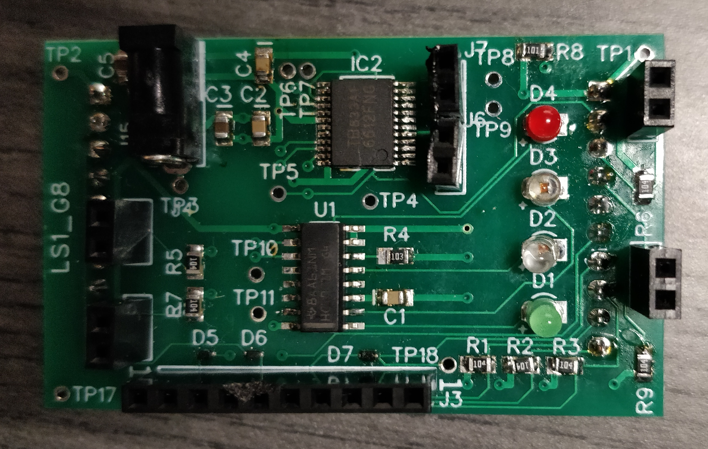
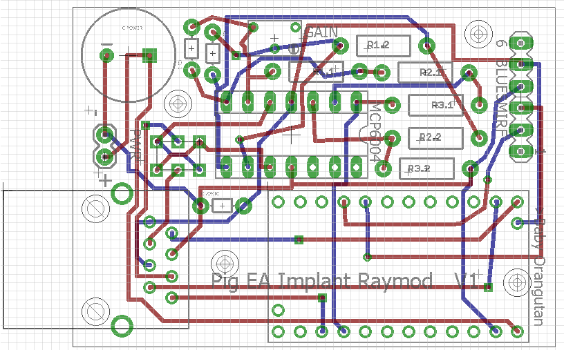

# Electrical

1. Coursework
2. Boston Children's Hospital

## Coursework

ECE 298 Instrumentation and Prototyping
- Designed and manufactured a Boosterpack expansion board for TI MSP430 with Diptrace
- Developed feasibility model, schematic, and PCB layout, while documenting the process
- Incorporated test points and power stability capacitors
- Assembled finished PCB using SMD components and reflow soldering techniques
- Implemented functions such as travel distance measurement, user input via keypad, and accurate instantaneous speed calculation in C through Code Composer Studio

 

## Boston Children's Hospital

- Reversed engineered and documented a microcontroller expansion board used to control a surgical implant robot designed treat esophageal atresia and short bowel syndrome in developing children
- Calculated resistor values needed in an instrumental amplifier circuit for force sensors
- Created custom schematic symbols and footprints for parts using Eagle
- Troubleshooted new boards to find an incorrectly mapped port breakout and fixed the issue
- Used Eagle to respin the old board layout and achieved a 30% size reduction while adding functionality

This happened during my BU RISE high school summer program. I was working for Dr. Dupont in the Pediatric Cardiac Bioengineering Lab to reverse engineer a PCB that they were using for a surgical implant robot.

They had a few of the boards, but they had lost the schematics and digital design files for the board and wanted me to recreate the design so they could build more in the future if necessary.

I had to identify part numbers, lookup datasheets, check pinouts, and follow PCB traces under a magnifier. I was able to identify the power, wireless, MCU, and sensor sections of the board, recreate the schematic and board layout in Eagle, and send out the design for fabrication, in 4 weeks. This was the first time I had touched anything related to PCB design.

I also managed to squeeze in some improvements. A 30% board footprint reduction was achieved, a DPDT switch was integrated for the sensor in case it was soldered backwards, and screw in power terminals were added for more robust operation (the entire unit was to be strapped to a pig).

I received the boards during week 6 of my internship, and assembled them. There was an issue that was rectified, but I was able to connect the robot to the board and perform all functions.

 