# Mechanical

Contents
1. 3D Printing
2. FRC Robotics

## 3D Printing

- Running an Ender 3 v2 using Klipper and Fluidd
- Currently building a Voron 0
- 3D Modeling is done in Fusion360 or OpenSCAD

### Mechanical Keyboards

Macropad v1
 
- Designed in OpenSCAD
- Wristrest is generated using Bezier Surfaces

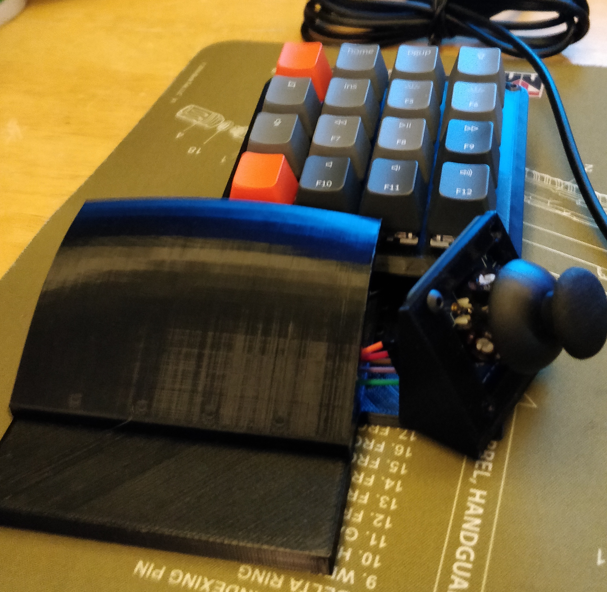

Dactyl Manuform

- Printed and assembled split hand wired mechanical keyboard, flashed firmware using QMK
- Keyboard body is generated online
- Designed robust MCU adapter for keyboard body

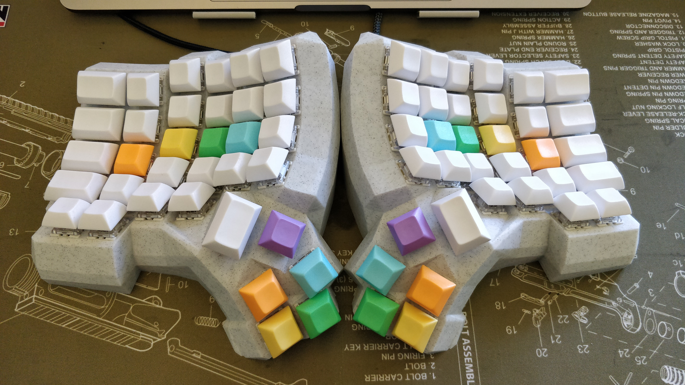
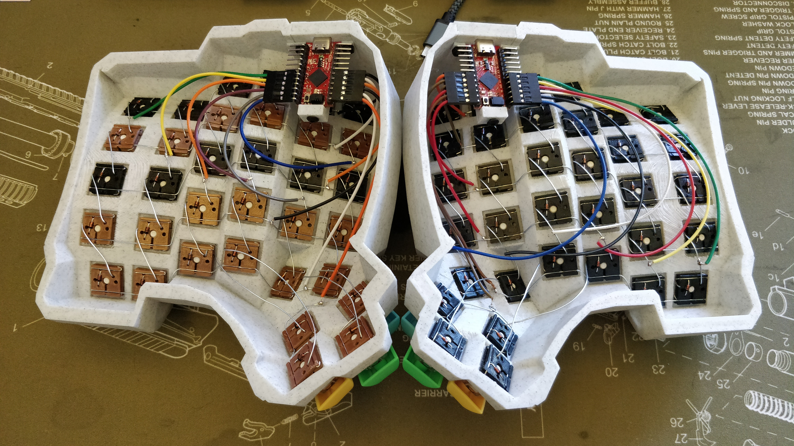

Handwire Hotswap Sockets

- Developed solderless hand wire key switch matrix system for mechanical keyboards
- Gives handwire keyboard builders greater flexibility and futureproofing for their builds
- See [github repo](www.github.com/stingray127/handwirehotswap) for more details

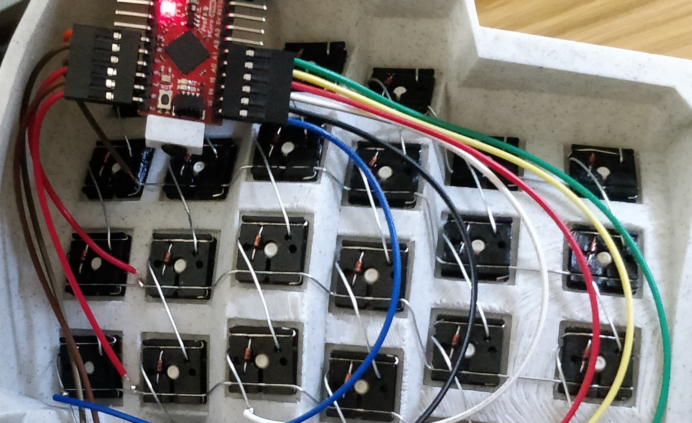

### Miscellaneous 

Monitor Stand

Needed more space on my desk, and we had a random piece of shelf sitting in the garage. Grabbed it, printed two beefy legs, and now I have a place to put my monitor.

CAD Model                  |  Result
:-------------------------:|:-------------------------:
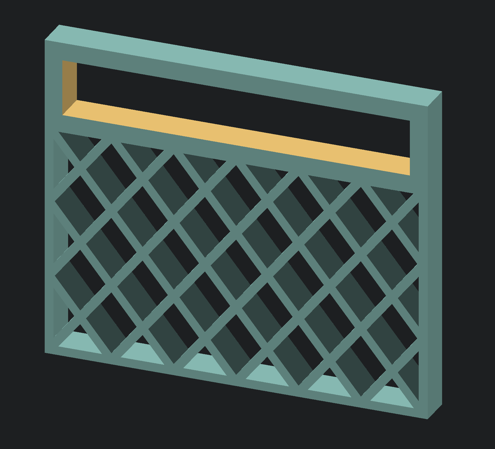 | 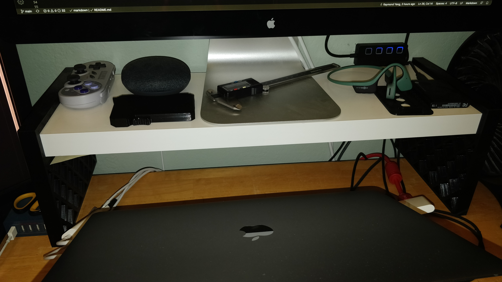

Desk Height Raiser

My dad wanted to raise the height of a desk by 25 mm. The 45 degree cut was so I can print the part in an orientation where the layer lines would not be a problem given the load.

CAD Model                  |  Result
:-------------------------:|:-------------------------:
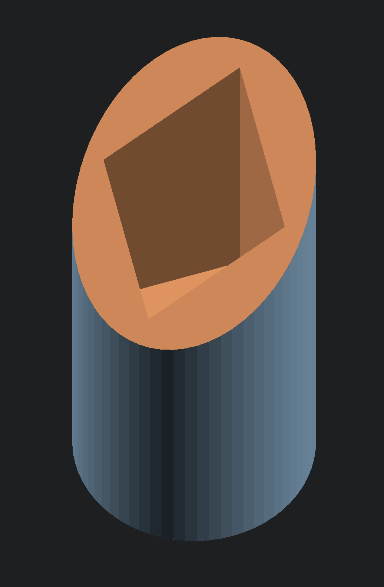 | 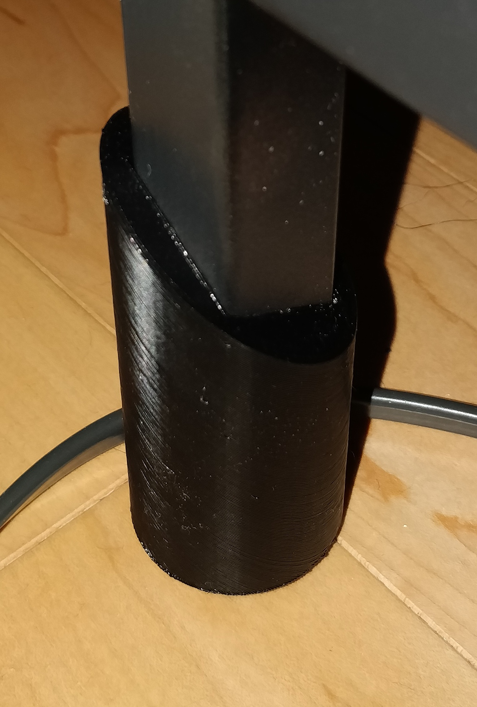

Oculus Quest MaulSaber

This one was remixed in Fusion360 from STls found online. It was so painful to work with STLs on that software that I now only use OpenSCAD when dealing with STLs. I also intend to redesign this and move the Quest controller batteries to the middle of the shaft to reduce wrist strain when spinning the saber.

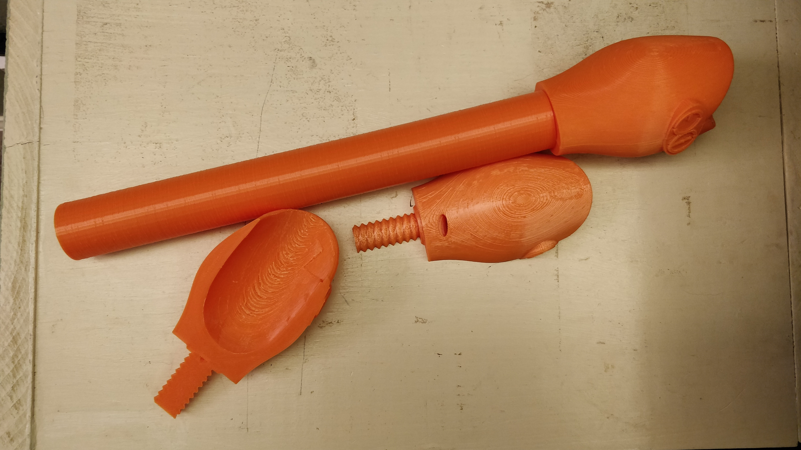 

Cat Laser Toy Tripod Adapter

This clamps to the bottom of an automatic laser pointer toy we got for the cat. The holes along the outside were for 3 screws in a tripod configuration to adjust the angle of the toy, and the center hole is a standard 1/4 inch camera mounting screw so I can mount the toy to an actual tripod.

CAD Model                  |  Result
:-------------------------:|:-------------------------:
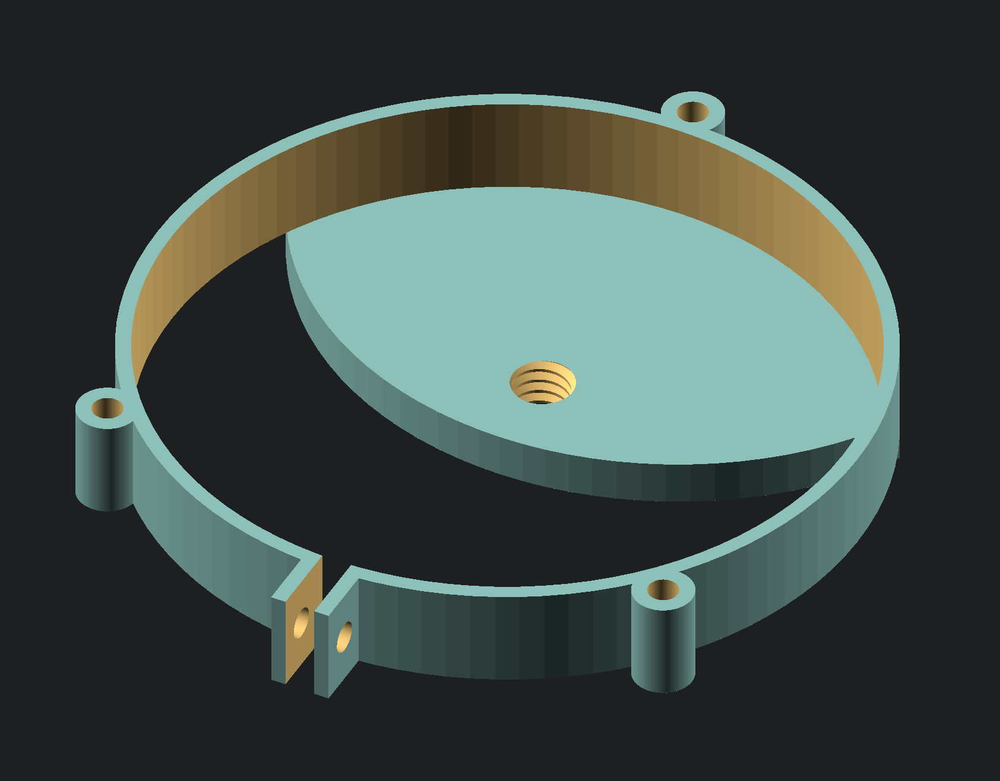 | Cat broke this and I don't have a picture whoops

## FRC Team 604 Engineering Lead

- Responsible for overall design and manufacturing of competition robots for 2015, 2016, and 2017
- Coordinated with mentors, machining sponsors, and multiple sub-teams to meet deadlines
- Adhered to Design for Manufacturing principles throughout design processes
- Utilized Solidworks CAD Software to create a full digital design to facilitate manufacturing
- Laid out and wired electronics and control systems of robots for all seasons
- Conducted field repairs and ad-hoc engineering solutions during competition seasons
- Ranked in top 12 worldwide, after winning the [1st. place in Hopper Division in 2017](https://www.thebluealliance.com/team/604/2017)

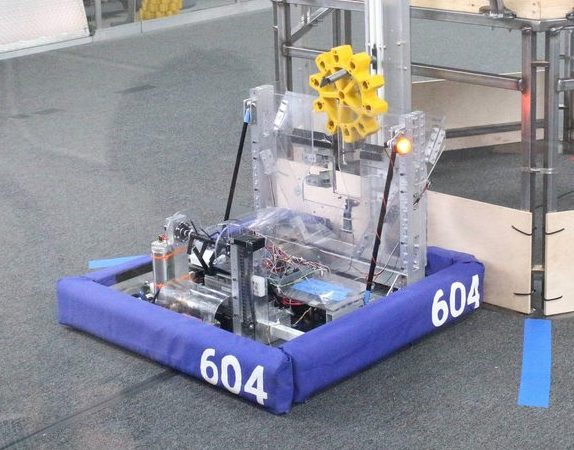

I was a primary mechanical designer for 3 years for my high school robotics team, and the lead mechanical designer for 2 years. In my last year on the team, we produced an internationally competitive robot, beating our competition through simple but focused mechanical design.

We modeled the entire robot, from gearboxes to screws, in large Solidworks assemblies. I can't say we used the best practices, but we did our best given our limited knowledge and 6 week build season.

I tried to rely on in house techniques as much as possible. As such, the only precision machining we needed on the 2017 robot were the milled holes for drivetrain and climber bearings in our aluminum 2x1 tubing. Everything else was designed around our limited in house manufacturing capabilities, and it came together beautifully.
