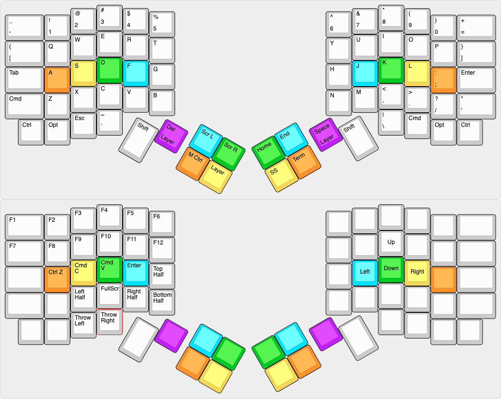

# Software

1. Personal Projects
2. Coursework
3. Work Experience

## Personal Projects

### Mechanical Keyboards

The software side of mechanical keyboards is just extensive firmware configuration in QMK. I define the keyboard's physical layout, what pins on the MCU correspond to which rows and columns of the matrix, and set keycodes all using a text editor. Then, I compile and flash the firmware through the command line.

Keymap design is also important in order to make a keyboard usable. In this instance, my keyboard halves are completely disconnected; the computer sees me using two completely separate keyboards. As a result, the keymap needs to have some changes to support this kind of usecase, like assigning Shift on the thumbs. This is my current keymap version, and I expect it to change in the near future.

### Voice Controlled Lighting

- Built voice controlled room lighting using Amazon Alexa, Node-Red, MQTT, and Python
- Reconfigured Raspberry Pi into a router and also used it to host a Mosquitto MQTT broker
- Used Node-Red to send MQTT message after Alexa received a verbal command
- Reconfigured SBC OS (openWRT) to add swapfile and expand internal storage
- Ran a python script on SBC to receive MQTT commands and trigger a relay to control lights

System Diagram:

## Coursework

ECE 224:  Embedded Microprocessor Systems
- Wrote music player in C with variable speed playback, scrubbing, and UI on a FPGA set up as SoC

ECE 320: Computer Architecture
- Implemented a 5 stage pipelined processor with forwarding and stalls for RISC-V ISA in Verilog

ECE 327: Digital Hardware Systems
- Built a matrix multiplier synthesized on a FPGA, implemented as a systolic array of MAC units

ECE 350: Real Time Operating Systems
- Built a single core RTOS on the DE1-SoC board using C and assembly, which comprised of a memory allocator, real time and multi-priority schedulers, IPC, and terminal input

ECE 351: Compilers
- Wrote a compiler in Java that translated VHDL-esque Boolean logic into RTL and waveform diagrams

## Work Experience

**Qualcomm** Embedded Audio Hardware Verification Intern
- Used Qt to develop a UI to automate the process of creating and running test cases for the verification and power analysis of an Audio Machine Learning hardware accelerator
- Implemented inter-process communication between target and UI using Trace 32 API and custom handshaking protocol, allowing UI to specify testing parameters and execute tests on target
- Wrote constrained randomization function to randomize test case options, improving test coverage during verification of accelerator

**BlueRover** Software Engineering Intern
- Designed and implemented an API to query and join MySql table entries for customer data retrieval
- Optimized web-socket usage to reduce inter-service latency and request runtime by 30% 
- Used React and Flux to build frontend to support real-time data streaming on web views, and created dynamic frontend pages for new site features

**Hubdoc** Software Engineering Intern
- Developed proof of concept that decoupled server logic and abstracted out functionality into AWS Lambdas to support serverless calls reducing server costs by 20%
- Automated web scraping using phantom.js and nightmare.js to retrieve client account documents
- Programmed bot workflows to navigate websites with 2FA, ReCaptchas, bot detection, etc

**Wind River Systems** Software Engineering Intern
- Created build pipeline to automate linux builds for production deploys, static analysis and sanity testing
- Re-architected database calls to exponentially reduce query runtime and reduce client-side memory usage
- Implemented full stack web app to display live product information using Bootstrap and Java backend
